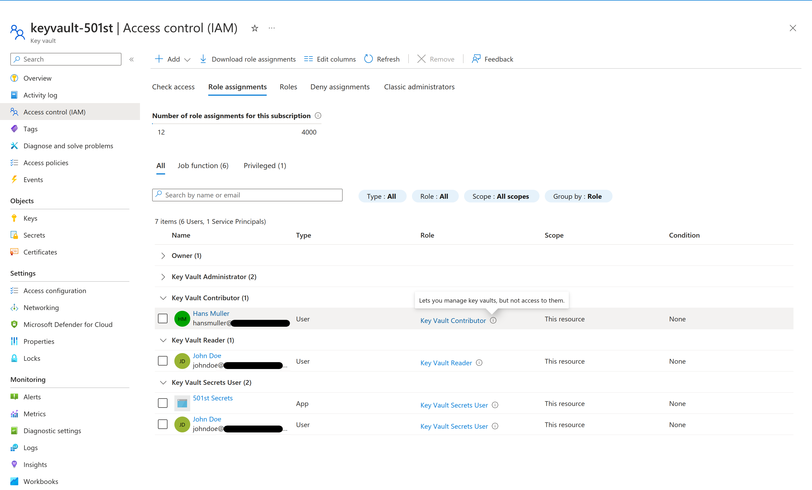
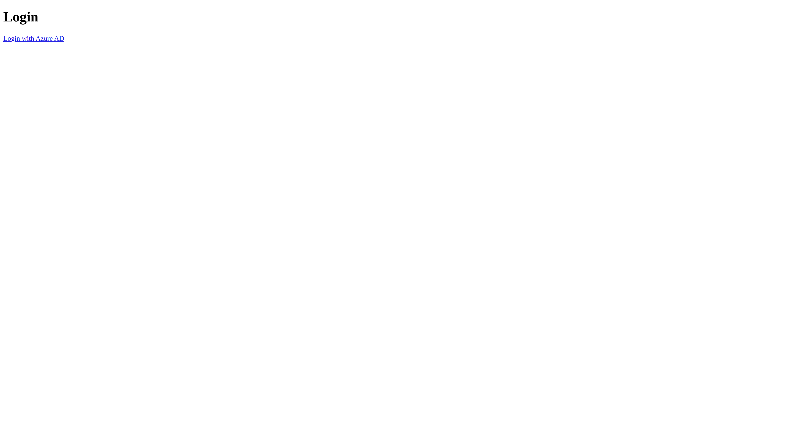
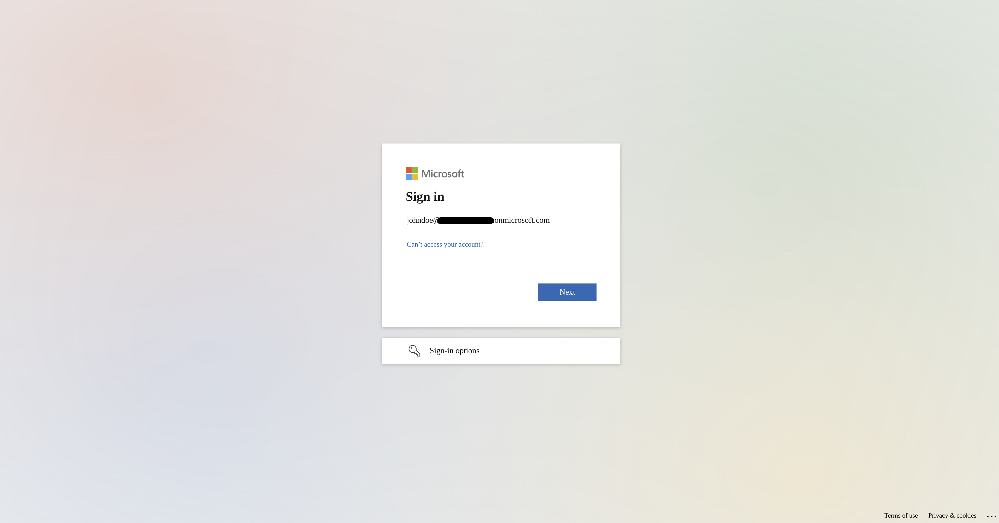
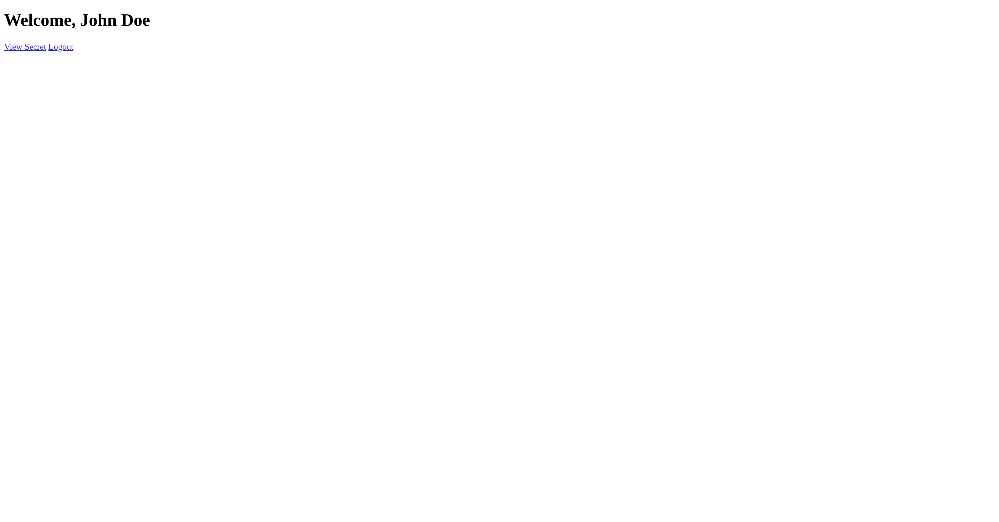
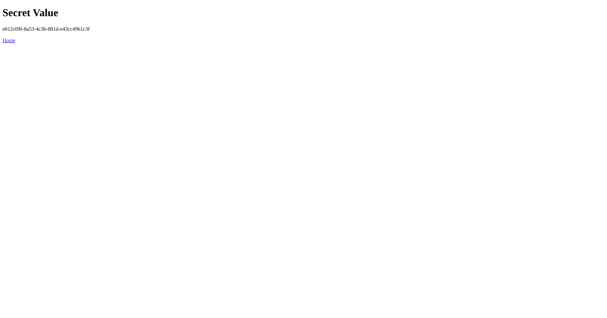
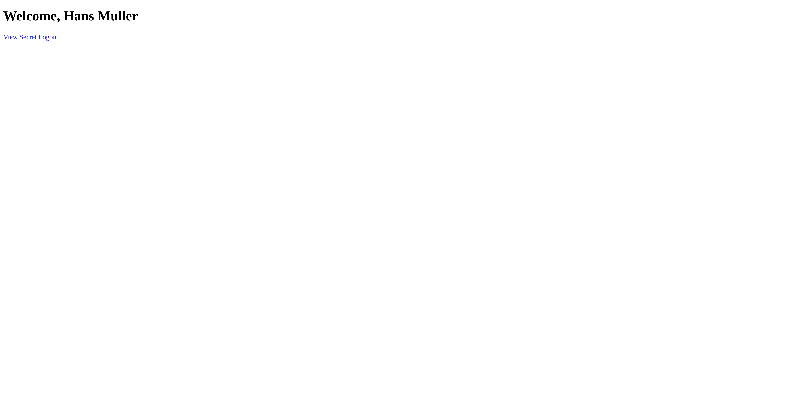
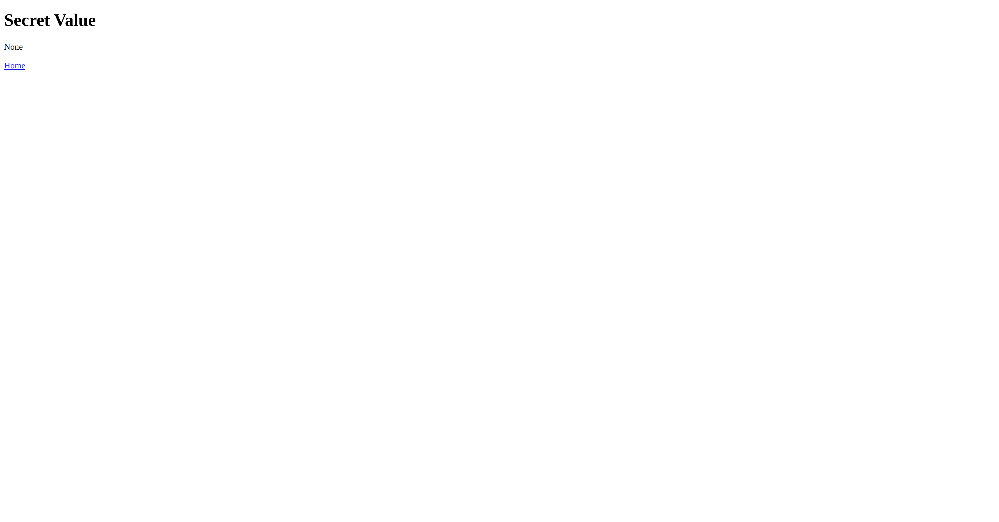

# Azure_Secret_Notes_Viewer
A very basic but functional web application that displays secret notes from Azure Keyvault only when the user logins.
_These secret notes can be passwords, api keys etc_


### Tehcnologies
- Python (Flask)
- Azure Key Vault
- Microsoft Entra ID/Azure AD (App Registries)
- Microsoft Authentication Library (MSAL) 
- HTML
- Azure: CLI, Container Registry, Container Instances, Functions, App Service (Web app), Insights and Monitor


### Infrastructure
- Azure App Service Web App (Hosting the web application)
- Azure Container Registry (Storing Docker images for the app)
- Azure Container Instance (Running the containers for development/testing)
- Azure Functions (Weather alert system)
- Azure Container Apps (Running the containers in production)


### Diagram

```
User 
|-> Login Portal (Hosted on Azure App Service)
   |-> User Authentication (Microsoft Azure Active Directory)
   |-> Configuration Data (Azure Key Vault)
```


### 501st Key Vault Users
<div align=center margin= auto> 
  
</div>

### Login
<div align=center margin= auto> 
  
</div>

### AD/MSAL Authentication
<div align=center margin= auto> 
  
</div>

### Successful Login (John Doe)
<div align=center margin= auto> 
  
</div>

### User (John Doe) with access policy and a secret (api key) assigned to them
<div align=center margin= auto> 
  
</div>

### Successful Login (Hans Muller)
<div align=center margin= auto> 
  
</div>


### User (Hans Muller) With No Secrets or Access to Secrets
<div align=center margin= auto> 
  
</div>


### Implementation Guide

   1) Set up an Azure Microsoft Entra Tenant/AD instance for user authentication. 
   2) Create test users in Microsoft Entra/Azure AD. 
   3) Create secrets in Azure KeyVault.
   4) Assign permissions to users in Azure AD such that each user has access to different secrets.
   5) Develop a web application that integrates with Azure AD for login functionality.
   6) Integrate Azure Key Vault in the application to fetch configuration data.
   7) Display the information in the web app once user logins.
   8) Deploy the application on Azure App Service.
   9) Setup Application insights and Azure monitor


### Next Steps 
Perhaps update the UI with a cleaner, more attractive front-end and then upload it to AZ App Service. 
